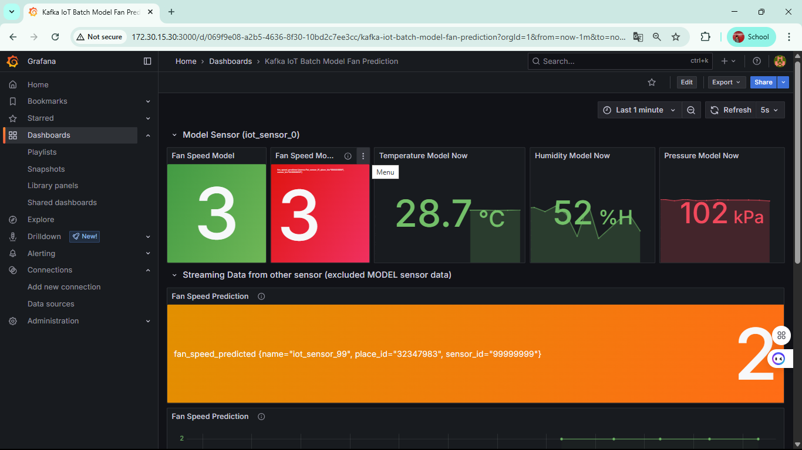

# Online Prediction
1. ให้ online ML เชื่อมต่อไปที่ InfluxDB
2. Load Model
3. เชื่อมต่อข้อมูลกับ Kafka
4. นำข้อมูลที่ได้จาก Kafka มาทำการ Predict
<!-- Online Prediction ทำงานอย่างไร  -->

## ปิดการใช้งานของ Batch ML ดังนี้

1. Kafka-to-Jsonl 
2. Train-from-data
3. Predict-then-influxdb

## เริ่มใช้งาน Online ML ดังนี้

1. docker compose down batch ML
2. แก้ไฟล์ .env ใน online-ml-predict
3. docker compose up online ML

## ผลที่ได้จากการใช้ ML มีดังนี้

<!-- แนบรูป Grafana  พร้อมอธิบาย -->

